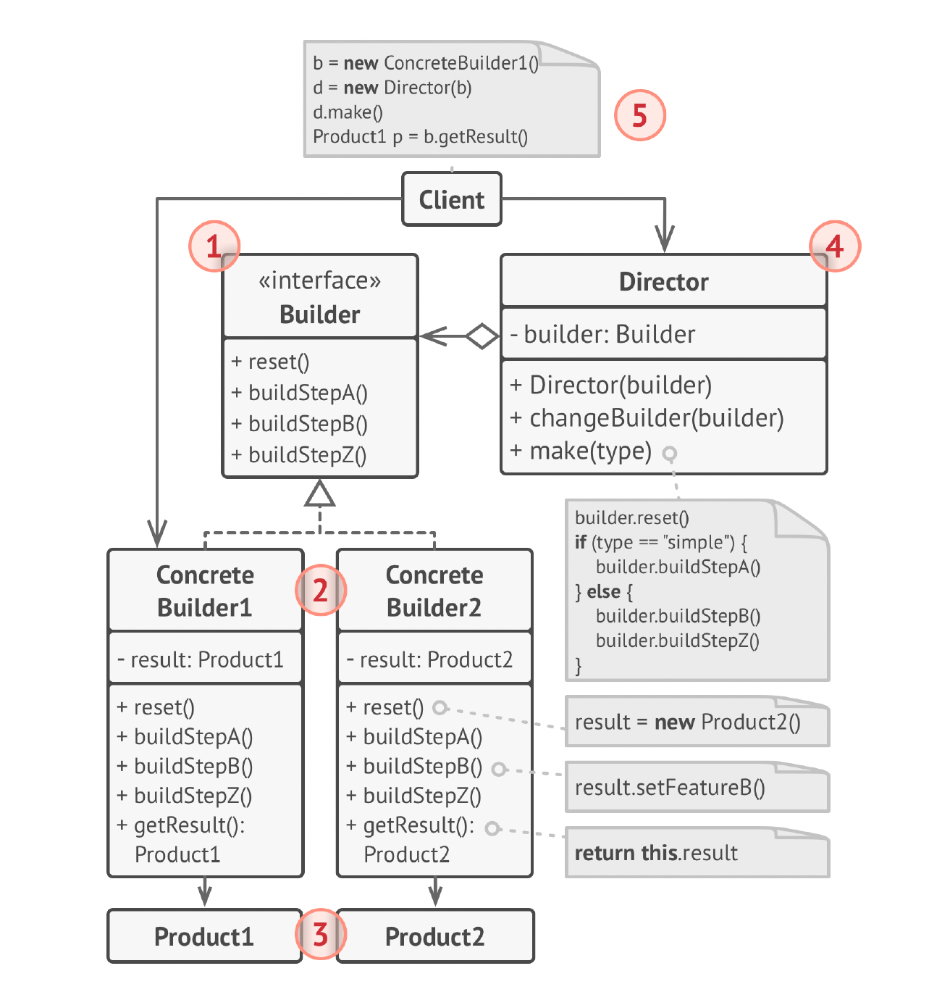

# Builder Design Pattern

The **Builder Pattern** is a creational design pattern that allows constructing complex objects step-by-step.  
It separates the construction process from the final representation, enabling the creation of different types or variations of an object using the same building steps.

---

## 📌 Overview

- Defines a **Builder interface** for creating parts of a complex object.
- Concrete builders implement the steps and produce different **Product** representations.
- The construction process is exposed via a fluent API.
- Useful when the product has **multiple optional fields** or requires **controlled construction**.

---

## 🎯 Motive

In many cases, an object may have:

- Many optional attributes
- Complex construction logic
- A need to be built in various combinations
- A requirement to avoid large telescoping constructors

Example of a telescoping constructor (hard to read, error-prone):

```java
new Product1(null, "val2", null, "val4", null, "val6");
```

## 📘 UML Diagram



---