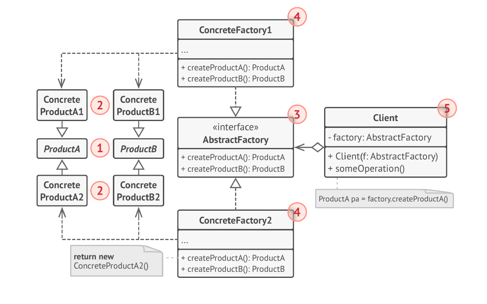

# Abstract Factory Design Pattern

The **Abstract Factory** is a creational design pattern that provides an interface to create **families of related objects** without specifying their concrete classes.

---

## 📌 Overview

- Creates **multiple related products** (ProductA, ProductB, etc.).
- Ensures the created products are **compatible with each other**.
- Allows switching entire product families (e.g., A1+B1 → A2+B2).
- Promotes loose coupling and the Open/Closed Principle.
- The client depends only on **abstract factories** and **abstract products**.

---

## 🎯 Motive

In many systems, multiple objects must be created together because:

- They **belong to a related family**.
- They are **designed to work together**.
- Mixing incompatible objects can break the system.

If you instantiate concrete products directly:

- The client becomes **tightly coupled** to many classes.
- Replacing a family requires **modifying client code**.
- Scaling to more product families becomes difficult.

**The motive of Abstract Factory is to centralize object-family creation and allow the system to switch entire product families without changing client code.**

---

## ❗ Problem It Solves

### ✔️ 1. Tight coupling to concrete products
Without Abstract Factory:

```java
ProductA a = new ConcreteProductA1();
ProductB b = new ConcreteProductB1();
```

## 📘 UML Diagram



---