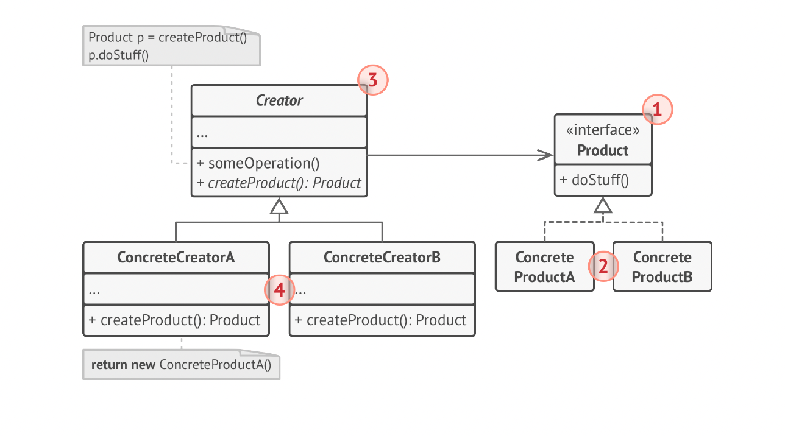

# Factory Method Design Pattern

The **Factory Method** is a creational design pattern that provides an interface for creating objects in a superclass, but allows subclasses to decide which concrete object will be created.

---

## 📌 Overview

- Allows the **superclass (Creator)** to create objects through a **Product interface**.
- **Subclasses** choose which concrete product to return.
- Focuses on creating **one type of product**.
- Promotes loose coupling and the Open/Closed Principle.

---

## 🎯 Motive

In many applications, classes directly instantiate concrete objects using `new`.  
This creates several problems:

- The class becomes **tightly coupled** to specific product classes.
- Any change in product type requires modifying the high-level code.
- Adding new product types requires updating existing logic.
- It becomes difficult to extend or scale the system.

**The motive of the Factory Method is to delegate object creation to subclasses, making the system flexible and open for extension without modifying existing code.**

---

## ❗ Problem It Solves

The Factory Method solves these key issues:

### ✔️ **1. Tight coupling to concrete classes**
Without this pattern:
```java
Product p = new ConcreteProductA();  // tightly coupled
```

## 📘 UML Diagram



---

